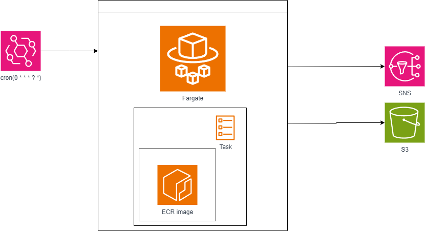

# Melhor preço para AWS

## Rastreador de Preços de Produtos

Este pequeno projeto tem como objetivo executar um código na AWS capaz de buscar informações sobre produtos específicos em sites de compras e notificar o usuário quando o produto desejado for encontrado a um preço ideal. Quando o preço está abaixo do limite definido uma notificação por email é mandada para os emails cadastrados no topico SNS. Os preços também são armazenados em um bucket no S3.



## Começando

Para configurar seu próprio ambiente, basta implantar o arquivo `deploy.sh`, certificando-se de personalizar as variáveis de nome do bucket.

### Pré-requisitos

Antes de começar, certifique-se de ter os seguintes pré-requisitos:

- Uma conta AWS com as permissões necessárias. (Write S3 e Publish SNS)
- AWS CLI instalado e configurado com suas credenciais da AWS.

### Implantação

1. Clone este repositório para sua máquina local.
2. Execute e preencha com suas credenciais:
 ```shell
    aws configure
``` 
3. Para fazer o deploy, execute o arquivo:
  ```shell
    ./deploy.sh
  ```
4. Não esqueçade adicionar o email no tópico SNS depois que a stack estiver criada. As variaveis de ambiente da Task guardam a string de busca e também o limite de preço.
5. Para mudar a string de busca, basta mudar o valor da variavel de ambiente "SEARCH".

### Melhorias:

Configurar a role da task corretamente para não precisar das credenciais

### Implementação Futura:
- Guardar as credenciais no Secret da AWS, atualmente elas são passadas por variavel de ambiente

